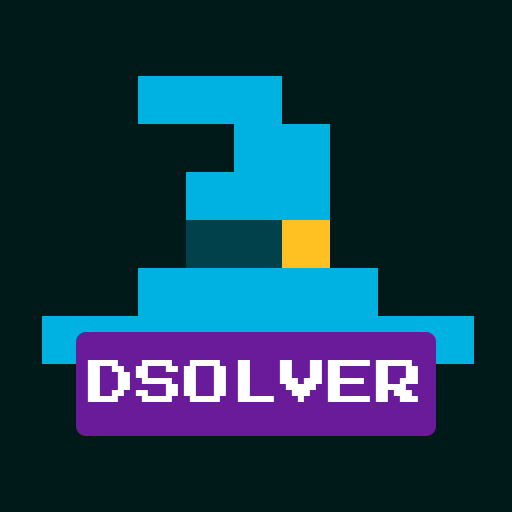

<p align="center">
  
</p>

<h1 align="center">DSolver Simulator</h1>

<p align="center">
  High-throughput DeFi swap simulation and route encoding on live Tycho-backed state.
</p>

<p align="center">
  <a href="https://github.com/dewiz-xyz/dsolver-simulator/actions/workflows/ci.yml">
    
  </a>
  <a href="LICENSE">
    
  </a>
  <a href="https://github.com/dewiz-xyz/dsolver-simulator/stargazers">
    
  </a>
  <a href="https://github.com/dewiz-xyz/dsolver-simulator/network/members">
    
  </a>
  <a href="https://github.com/dewiz-xyz/dsolver-simulator/issues">
    
  </a>
</p>

<p align="center">
  
  
  
</p>

<p align="center">
  <a href="#quick-start">Quick start</a> ·
  <a href="#api-surface">API</a> ·
  <a href="#verification">Verification</a> ·
  <a href="#docs-map">Docs</a>
</p>

DSolver Simulator is a Rust service for DeFi quote simulation and route encoding. It subscribes to the internal Tycho broadcaster for native and VM state, maintains an in-memory view of pool state, and exposes fast HTTP endpoints for quoting, route settlement encoding, and readiness checks.

## What It Is

- Live-state simulation service for swap and routing workloads.
- Built on Axum and Tokio, with `tycho-simulation` and `tycho-execution` handling pricing and route execution details.
- Designed for solver and routing integrations that need both quote coverage and deterministic route encoding behavior.

## Why Teams Use It

- Continuous ingestion of native and optional VM-backed pool state through the internal broadcaster service.
- Structured `/simulate` responses that distinguish usable quotes, partial coverage, warmup states, and request-level failures.
- `/encode` route resimulation before calldata generation, so settlement interactions are built from the same runtime view used for quoting.
- Reporting-first local analysis tooling for readiness, latency, sampled evidence, and quick regression investigation.

## At A Glance

| Category | Details |
| --- | --- |
| Language | Rust 2021 |
| Runtime | Axum + Tokio |
| Binary | `dsolver-simulator-service` |
| Endpoints | `GET /status`, `GET /ready`, `POST /simulate`, `POST /encode` |
| Supported chains | Defined in `simulator-manifest.toml` |
| Required inputs | `CHAIN_ID`, `TYCHO_BROADCASTER_URL`, Redis connection settings; the broadcaster also requires `TYCHO_API_KEY` |
| Common optional inputs | `RPC_URL`, `ENABLE_VM_POOLS`, `ENABLE_RFQ_POOLS`, `HOST`, `PORT` |
| License | MIT |

## Quick Start

```bash
cp .env.example .env
scripts/start_server.sh --repo . --chain-id 1
scripts/wait_ready.sh --url http://localhost:3000/ready --expect-chain-id 1
```

Use the explicit `-p ... --bin ...` form for local runs and builds so it's always clear which
workspace binary you're targeting.

For manual service runs, start `dsolver-tycho-broadcaster-service` first on the port used by
`TYCHO_BROADCASTER_URL`, then start `dsolver-simulator-service`.

Required runtime inputs:

- `TYCHO_API_KEY` for the broadcaster's Tycho access; the simulator does not use it
- `CHAIN_ID` for chain selection from `simulator-manifest.toml`
- `TYCHO_BROADCASTER_URL` pointing at the active broadcaster HTTP base URL, for example `http://127.0.0.1:3001`
- `BROADCASTER_REDIS_URL` and `BROADCASTER_REDIS_STREAM_KEY` for the Redis stream that carries broadcaster deltas after each HTTP snapshot replay boundary

Common optional inputs:

- `RPC_URL` to enable on-chain helpers that need JSON-RPC access, such as ERC4626 deposits
- `ENABLE_VM_POOLS` to enable or disable VM-backed pool feeds
- `ENABLE_RFQ_POOLS` to enable or disable RFQ pool feeds (defaults to `false`)
- `BEBOP_KEY` as Bebop's single Bearer credential, plus `HASHFLOW_USER`, `HASHFLOW_KEY`, `LIQUORICE_USER`, and `LIQUORICE_KEY`, only when `ENABLE_RFQ_POOLS=true` for chains that enable those RFQ providers
- `HOST` and `PORT` to change the bind address
- `BROADCASTER_TOKEN_MIN_QUALITY` to tune the broadcaster's startup Tycho token quality floor
- `BROADCASTER_SNAPSHOT_MAX_PAYLOAD_BYTES` to cap serialized HTTP snapshot payloads
- `BROADCASTER_SNAPSHOT_SESSION_TTL_SECS` to set how long an unattached snapshot session can wait before cleanup
- `BROADCASTER_REDIS_BLOCK_MS`, `BROADCASTER_REDIS_READ_COUNT`, and `BROADCASTER_REDIS_APPEND_RETRY_WINDOW_MS` to tune Redis stream reads and append retries
- `BROADCASTER_REDIS_MAXLEN` caps retained Redis entries (default `5000`) and forces simulators to rebootstrap if replay data is trimmed before catch-up
- `TOKEN_SNAPSHOT_TIMEOUT_MS` for the simulator's startup load of the full broadcaster token snapshot
- `TOKEN_REFRESH_TIMEOUT_MS` for RFQ provider token bootstrap and later single-token lookup misses
- timeout and stream-health knobs from `crates/runtime/src/config/mod.rs`

`crates/runtime/src/config/mod.rs` is the authoritative source for runtime defaults. `.env.example`
is an example setup, not the source of truth for every default.

## Runtime Continuity Contract

The simulator bootstraps local state from the active broadcaster's HTTP snapshot session, then replays Redis Stream deltas after the snapshot replay boundary returned by that session. Redis is the delta transport, not the full-state bootstrap store.

The shared `broadcaster-replay-client` crate owns that bootstrap and Redis replay contract, so simulator and external consumers use the same checkpoint, gap detection, and recovery rules.

Optional broadcaster state history persists full-state checkpoints, token snapshots, and ordered deltas for historical replay and analysis. See [docs/state_history.md](docs/state_history.md) for the segment model, PostgreSQL schema, S3 objects, Rust reader API, environment variables, status fields, and retention contract.

The separate Historical Pool Quote API reconstructs retained Base state for one exact component and token direction. It uses an HTTP-only Rust CLI and has no direct broadcaster, Redis, primary database, or state-history write path. Client users should start with [docs/historical_pool_quote_client.md](docs/historical_pool_quote_client.md); maintainers can use [docs/historical_pool_quote_api.md](docs/historical_pool_quote_api.md) for the service, API, limits, image, and operator workflow.

Broadcaster deployments use four modes:

- `Passive` warms upstream/cache state, but does not append Redis deltas or serve snapshot sessions.
- `Active` is the only Redis writer and the only snapshot-session authority for an environment and chain.
- `Retired` rejects appends and snapshot sessions after it has been replaced.
- `Unhealthy` fails closed until it recovers or is replaced.

Redis append and snapshot-session creation are fenced so stale writers cannot publish after promotion. A same-process reconnect keeps the writer generation and publishes a private full-replacement recovery transaction through the existing Redis stream. Consumers expose that replacement only after its commit, then apply ordered catch-up entries. Invalid, incomplete, or trimmed recovery data fails closed and falls back to a fresh HTTP bootstrap. Each simulator uses its own `XREAD` position; the design does not use Redis consumer groups or per-deployment stream keys.

## API Surface

- `POST /simulate` returns per-pool quotes across the requested amounts plus `meta` describing quote completeness, failures, and readiness-adjacent request outcomes.
- `POST /encode` accepts a client-provided route, re-simulates the swaps internally, and returns ordered settlement `interactions[]`.
- `GET /status` is a liveness endpoint that always reports the current state with HTTP `200`.
- `GET /ready` uses HTTP `200` or `503` for native traffic readiness and includes the same backend detail.

`/encode` keeps its current HTTP control flow, but the server emits one structured completion log per request with route shape, protocol summary, and failure-stage fields. Detailed resimulation traces stay available at `debug`.

Detailed integration docs:

- [docs/simulate_example.md](docs/simulate_example.md) for `/simulate` request and response shape
- [docs/encode_example.md](docs/encode_example.md) for `/encode` request and response shape

## Quote Outcome Semantics

`/simulate` uses a structured response contract. Clients should not treat HTTP `200 OK` as quote success on its own.

`QuoteStatus` is the top-level request state:

- `ready`
- `warming_up`
- `token_missing`
- `no_liquidity`
- `invalid_request`
- `internal_error`

`QuoteResultQuality` describes result completeness:

- `complete`
- `partial`
- `no_results`
- `request_level_failure`

`meta.partial_kind` appears only when `result_quality=partial`:

- `amount_ladders`
- `pool_coverage`
- `mixed`

Summary matrix:

| Situation | `meta.status` | `meta.result_quality` | Usable For Quoting |
| --- | --- | --- | --- |
| Usable quotes with full coverage | `ready` | `complete` | yes |
| Usable quotes with partial requested-amount coverage or incomplete pool coverage | `ready` | `partial` | yes |
| No usable quote because liquidity is absent or exhausted | `no_liquidity` | `no_results` | no |
| Request completed with valid payload but request-level failure details | `ready` or `internal_error` | `request_level_failure` | no |
| Warm-up, token coverage, or request validation problem | `warming_up`, `token_missing`, or `invalid_request` | `request_level_failure` | no |

`/simulate` results are usable for quoting when:

- `meta.status=ready`
- `meta.result_quality=complete` or `meta.result_quality=partial`

`meta.failures` is the request-level failure summary. It captures timeouts, cancellations, token coverage problems, no-pools reasons, and request-relevant simulation failures.

`meta.pool_results` is the per-pool outcome summary. It captures pool-local outcomes such as `partial_output`, `zero_output`, `timed_out`, `simulator_error`, and `internal_error`.

For partial results, emitted pool rows keep the original request order and request length in `amounts_out`. Requested amounts that fail are serialized in place as `"0"`, and the matching `gas_used` entries are `0`.

Treat `"0"` in `amounts_out` as "this requested amount did not produce a usable quote for that pool," not as a real quote. `data[]` only contains pools that produced at least one positive output across the requested amounts. Fully-zero rows are filtered out of `data[]` and stay visible only through `meta.failures` and `meta.pool_results`.

`data[]` order is deterministic, but it is not a best-to-worst ranking. Clients should rely on requested-amount alignment within each row and evaluate returned pools explicitly instead of inferring meaning from `data[0]`.

`meta.vm_unavailable=true` means VM pools were skipped because VM state was not ready. When usable native quotes still exist, that typically surfaces as a `ready + partial` response rather than a hard non-ready status.

## Readiness And Timeouts

`GET /status` is the liveness view and always returns `200 OK`. `GET /ready` is the readiness source of truth:

- `200 OK` from `/ready` with `status="ready"` when native traffic can be served
- `503 Service Unavailable` from `/ready` while native readiness is not ready
- `backends.native.status="ready"` when the broadcaster subscription is live, bootstrap is complete, and native state is ready and not stale
- `backends.native.status="warming_up"` while initial native state is still loading
- `backends.native.status="stale"` when native updates are past the readiness freshness window

`backends.vm.status` is one of:

- `disabled`
- `warming_up`
- `rebuilding`
- `stale`
- `ready`

`backends.rfq.status` is one of `disabled`, `warming_up`, `stale`, or `ready`. Native and VM backend status use `block_number`; RFQ backend status uses `update_timestamp` for the current Tycho RFQ update cursor.

Timeout behavior differs by endpoint:

- `/simulate` request-guard timeouts return `200 OK` with a contract-valid payload whose `meta.status=ready`, `meta.result_quality=request_level_failure`, and `meta.failures` includes a `timeout`
- `/simulate` router-boundary timeouts also return `200 OK` with `result_quality=request_level_failure`
- `/encode` router-boundary timeouts return `408 Request Timeout` with `{ "error": "..." }`, plus `requestId` when it is available
- `/status` and `/ready` are not wrapped in the router timeout layer

For ops, `/encode` timeout and failure logs include stable `encode_error_kind` and `failure_stage` fields so CloudWatch queries can separate validation, readiness, normalization, resimulation, encoding, `handler_timeout`, and `router_timeout` paths.

If you are integrating against `/simulate`, inspect `meta` on every successful HTTP response. If you are integrating against `/encode`, normal HTTP success and error handling is still the right control flow.

## Deployments

Production task definitions pin immutable git SHA image tags, so pushing an image is inert. The force redeploy steps only cycle tasks on the SHA already pinned. Go live by bumping `imageTag` in the solver-iac stack YAML and manually dispatching that stack there. The staging push flow still exists, but it deploys into a fully dark environment.

## Verification

CI-equivalent commands:

```bash
cargo fmt --all -- --check
cargo clippy --workspace --all-targets --all-features -- -D warnings
cargo nextest run --workspace
cargo build -p apps --bin dsolver-simulator-service --release
cargo build -p apps --bin dsolver-tycho-broadcaster-service --release
cargo build -p apps --bin state-history-migrate --release
cargo build -p historical-quote-service --release
cargo build -p dsolver-history --release
scripts/verify_state_history.sh --repo .
```

Local analysis harness:

```bash
cargo run -p apps --bin sim-analysis -- --chain-id 1 --stop
cargo run -p apps --bin sim-analysis -- --chain-id 8453 --stop
```

When `TYCHO_BROADCASTER_URL` points at local loopback, the analyzer uses the repo lifecycle
helper to start Redis, the broadcaster, then the simulator. Non-local broadcaster or Redis URLs
are treated as externally managed. To verify the Redis replay path while services are running:

```bash
scripts/verify_broadcaster_redis.sh --repo .
```

To run the live mainnet VM wire e2e, point at an already running mainnet
broadcaster plus Redis and enable the explicit live-test gate:

```bash
DSOLVER_LIVE_MAINNET_VM_E2E=1 \
TYCHO_BROADCASTER_URL=http://127.0.0.1:3001 \
BROADCASTER_REDIS_URL=redis://127.0.0.1:6379 \
cargo test -p runtime mainnet_vm_liquidity_survives_snapshot_and_redis_delta_wire \
  -- --ignored --nocapture --test-threads=1
```

The test expects Curve and Balancer VM deltas from live mainnet traffic. A normal
run should usually finish in about 10 minutes, and it fails after 20 minutes.

Container builds:

```bash
docker build --secret id=github_token,env=GITHUB_TOKEN -f Dockerfile.simulator-service -t dsolver-simulator-service .
docker build --secret id=github_token,env=GITHUB_TOKEN -f Dockerfile.broadcaster-service -t dsolver-tycho-broadcaster-service .
docker build -f Dockerfile.historical-quote-service -t historical-quote-service:test .
```

Useful helpers:

- `scripts/start_server.sh` to start the local broadcaster plus simulator stack with repo-local PID and log files
- `scripts/wait_ready.sh` to poll `/ready` and enforce chain, native, VM, and RFQ readiness expectations; native readiness remains the default gate
- `scripts/verify_broadcaster_redis.sh` to check the broadcaster replay boundary, available Redis stream history, and simulator catch-up status
- `scripts/stop_server.sh` to stop services started by the repo helper
- `cargo run -p apps --bin sim-analysis -- ...` to generate a JSON and markdown local behavior report

The analyzer is intentionally reporting-first. It exercises representative `/simulate` and `/encode` flows, plus latency and light stress probes, then writes artifacts under `logs/simulation-reports/`, including simulator and broadcaster log excerpts, so reviewers can inspect anomalies, compare against previous local runs, and decide what matters instead of relying on a rigid pass or fail harness. On Base, RFQ-enabled runs also include a Bebop partial-fill encode diagnostic that inspects router calldata for the packed `originalFilledTakerAmount` token-in invariant.

## Docs Map

- [docs/simulate_example.md](docs/simulate_example.md): `/simulate` API examples and integration notes
- [docs/encode_example.md](docs/encode_example.md): `/encode` API examples and route-shape notes
- [docs/quote_service.md](docs/quote_service.md): maintainer deep dive for quote lifecycle, classification, observability, and integrations
- [docs/historical_pool_quote_client.md](docs/historical_pool_quote_client.md): client guide for historical Base pool quotes through `dsolver-history`
- [docs/historical_pool_quote_api.md](docs/historical_pool_quote_api.md): service architecture, HTTP API, limits, and operator workflow
- [STRESS_TEST_README.md](STRESS_TEST_README.md): local simulation analysis workflow and report artifacts
- [skills/historical-pool-quote-cli/SKILL.md](skills/historical-pool-quote-cli/SKILL.md): repo-local workflow for requesting and interpreting historical pool quotes
- `skills/simulation-service-analysis/SKILL.md`: repo-local analysis skill
- `skills/tycho-cloudwatch-logs/SKILL.md`: CloudWatch log triage workflow

## License

This project is licensed under the [MIT License](LICENSE).
